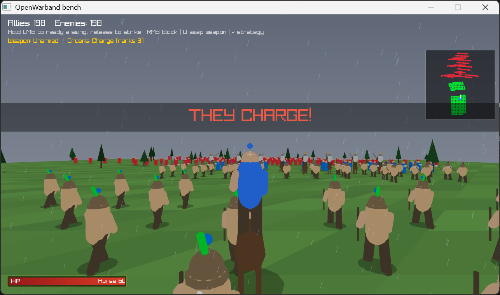
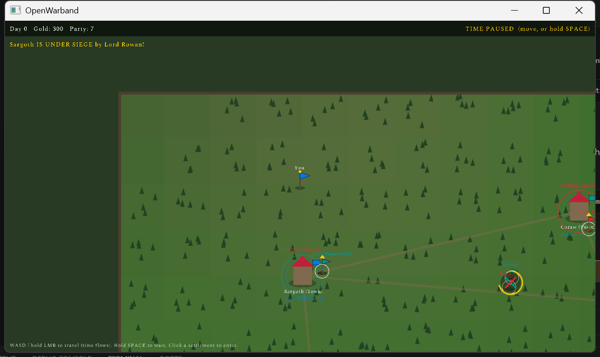
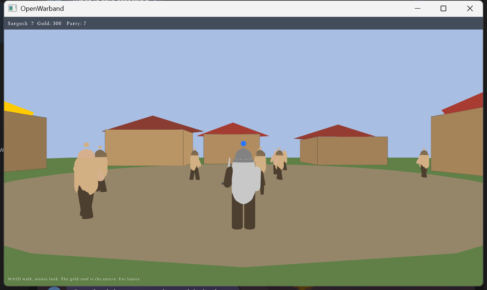
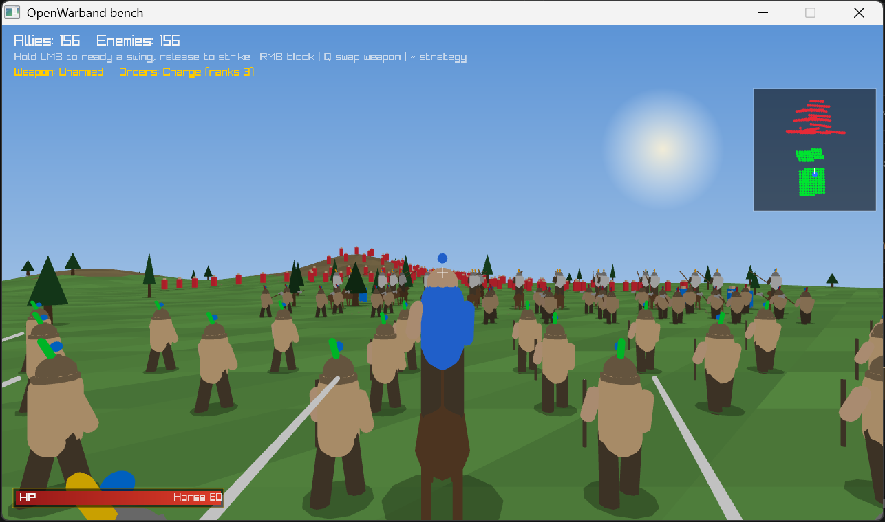
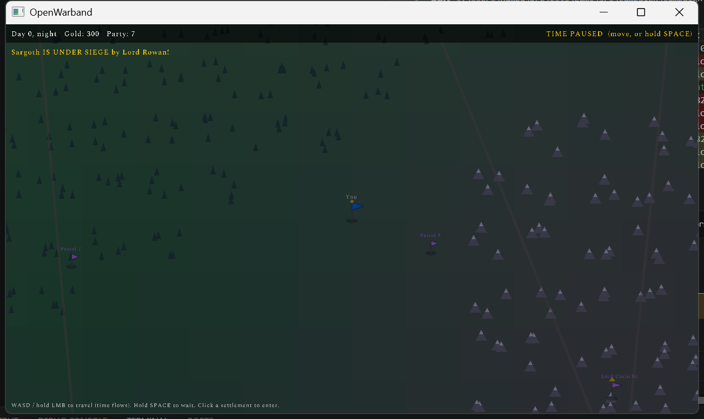

# OpenWarband

A Mount & Blade–style sandbox war game in C++17 with [raylib](https://www.raylib.com/).
Cross-platform: Windows, Linux, macOS — one CMake build, raylib fetched automatically.



Raise a warband, take the land, hold it. Factions field named **lords** with
armies in the hundreds who march, besiege, and capture settlements on a living
campaign map — with or without you.

## What's in the game

- **Campaign map** — a paused-time overworld (time flows only while you act)
  with a full day/night cycle. Factions war over settlements: lords muster
  hosts, invest castles, and respawn to fight again. Skirmishes you can watch
  or join on either side. **Live diplomacy**: wars build weariness from their
  casualties, weary crowns swear truces, and lapsed truces rekindle the fight.
- **Real-time 3D battles** — Mount & Blade-style directional melee (hold LMB,
  aim the swing with mouse motion, release to strike; RMB blocks), archers
  with ballistic arrows, formation orders (line/square/spread via `~`),
  procedural terrain **and weather** generated from where you fight on the
  map — some fields are fought in the rain. Enemy armies form a battle line
  and break into the charge together, with a war cry. Multithreaded soldier
  AI; 1000-soldier battles hold 40+ FPS.
- **Sieges** — storm walled towns and castles through a contested gate while
  garrison archers shoot from the ramparts; victories transfer ownership.
- **Walkable settlements** — enter a town and walk its streets: procedural
  buildings, villager NPCs, recruiting at the gold-roofed tavern.
- **Warband management** — troops earn XP and promote along upgrade trees;
  daily wages vs settlement income (unpaid troops desert); a tiled
  Diablo-style inventory fed by battle loot; hero levels and attributes.
- **Save/load** — quicksave (F5/F9), autosave on quit, Continue at the title.

| | |
|---|---|
|  |  |
|  |  |

## Controls

| Context | Keys |
|---|---|
| Campaign | WASD / hold LMB travel · SPACE wait (time flows) · click settlement to enter or assault · P party · I inventory · C character · F5/F9 save/load · Esc×2 quit (autosaves) |
| Battle | WASD move · mouse look · hold LMB + flick to aim swing, release to strike · RMB block · Q swap weapon · `~` formation orders · SPACE jump |
| Settlement | WASD walk · number keys recruit at the tavern · Esc leave |

## Building

CMake ≥ 3.20 and a C++17 compiler. First configure needs internet (raylib via
FetchContent).

**Windows** — `./build.ps1` auto-detects MSVC or MinGW. Manually (MinGW):
```powershell
cmake -B build -G "MinGW Makefiles" -DCMAKE_BUILD_TYPE=Release
cmake --build build -j
./build/openwarband.exe
```

**Linux**
```sh
sudo apt install build-essential cmake libx11-dev libxrandr-dev libxinerama-dev \
                 libxcursor-dev libxi-dev libgl1-mesa-dev   # Debian/Ubuntu
cmake -B build -DCMAKE_BUILD_TYPE=Release && cmake --build build -j
./build/openwarband
```

**macOS**
```sh
brew install cmake
cmake -B build -DCMAKE_BUILD_TYPE=Release && cmake --build build -j
./build/openwarband
```

## For developers

The game is **data-driven**: armour, weapons, troops, factions, and attributes
are definitions in `src/content.cpp`, referenced everywhere by handle — adding
content is adding a registry entry. Numbers are deliberately flat placeholders
(`TODO(balance)`): structure first, tuning later.

It is also **fully playable headless**: every screen splits input-gathering
from simulation, so `openwarband --script tests/soak.txt` drives real gameplay
from a command script (see `tests/README.md`), and `--bench N` measures battle
rendering. See [CLAUDE.md](./CLAUDE.md) for architecture and
[ROADMAP.md](./ROADMAP.md) for what's built and what's next.
